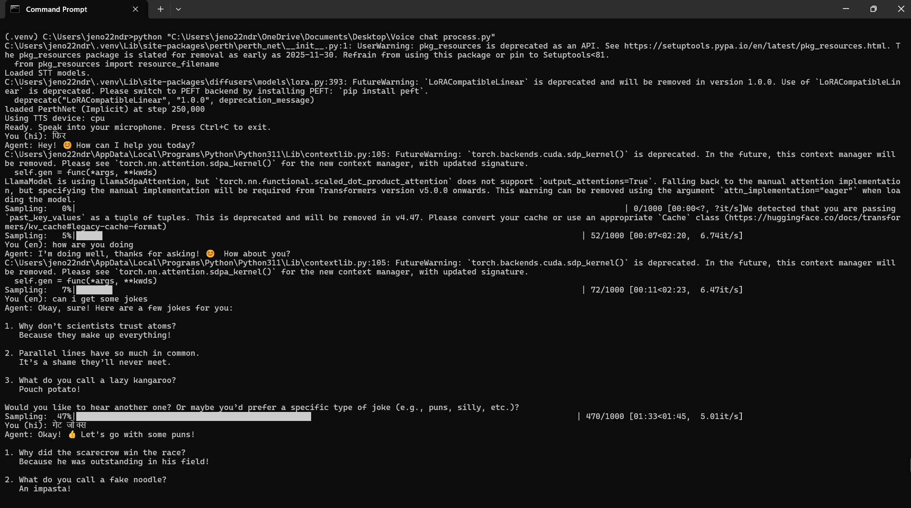

<h1 align="center">🎙️ <strong>LocalVoiceAI</strong></h1>

  <!-- Dark-Mode Compatible Badges -->
  
  
  
  

  <!-- GitHub Dynamic Badges (REPLACE YourUsername) -->
  
  
  

  

<blockquote>

<b>A privacy-centric, fully autonomous voice assistant architecture featuring Speech-to-Text, Local LLM integration via Gemma3 1B, and Text-to-Speech synthesis.</b>

</blockquote>

<h2>📜 Description</h2>

<blockquote>

<b>LocalVoiceAI</b> implements a privacy-centric, fully autonomous voice assistant architecture.

The system is designed for <code>Central Processing Unit (CPU)</code> execution, enabling deployment on local hardware without reliance on cloud-based services.

The pipeline performs the following functions:

<ul>
<li><code>Acoustic Input Processing</code>: Utilization of Vosk for offline Speech-to-Text (STT).</li>
<li><code>Cognitive Processing</code>: Integration of a local LLM via Ollama (Gemma3:1b).</li>
<li><code>Acoustic Output Synthesis</code>: Employment of Chatterbox TTS for localized voice synthesis.</li>
<li><code>Data Lifecycle Management</code>: Automated deletion of temporary audio artifacts.</li>
</ul>
</blockquote>

<h2>✨ Key Features</h2>

<blockquote>
<ul>
<li> High-fidelity transcription of Indian English and Hindi dialects utilizing the Vosk toolkit.</li>

<li> Deployment via Ollama (gemma3:1b), ensuring zero network latency and data transmission during runtime.</li>

<li> Generation of naturalistic speech patterns via the Chatterbox library.</li>

<li> The architecture ensures that no audio data or textual transcripts are transmitted to external servers.</li>

<li> Verified functionality on Windows, Linux, and macOS.</li>

<li> Native support for bilingual conversational exchanges in English and Hindi.</li>
</ul>
</blockquote>

<h2>🛠️ Technology Stack</h2>

<blockquote>

<code>Core Language</code> : Python 3.11 (Strict Requirement)
  
<code>Computer Vision/Audio</code> : Vosk, SoundDevice
  
<code>Machine Learning</code> : Ollama (Gemma3:1b)
  
<code>Speech Synthesis</code> : Chatterbox TTS
  
<code>Build Tools</code> : Cython, Wheel, Setuptools

</blockquote>

<h2>🖥️ System Requirements</h2>

<blockquote>

<b>Note:</b> This architecture utilizes a <code>CPU-First Design</code>, optimized for execution on standard laptop processors.

<table width="100%">
<thead>
<tr>
<th>Component</th>
<th>Minimum Specification</th>
<th>Recommended Specification</th>
</tr>
</thead>
<tbody>
<tr>
<td><b>CPU</b></td>
<td>4 Cores (e.g., Intel i5 / Ryzen 5)</td>
<td>6-8 Cores (e.g., Intel i7 / Ryzen 7)</td>
</tr>
<tr>
<td><b>RAM</b></td>
<td>8 GB</td>
<td>16 GB+</td>
</tr>
<tr>
<td><b>Storage</b></td>
<td>20 GB SSD</td>
<td>500 GB SSD</td>
</tr>
<tr>
<td><b>GPU</b></td>
<td>Integrated Graphics</td>
<td>Optional (NVIDIA 6GB+ VRAM)</td>
</tr>
</tbody>
</table>
</blockquote>

<h2>⚙️ Installation</h2>

<blockquote>

<h3>Prerequisites</h3>
<ul>
<li><code>Python 3.11</code></li>
<li><code>Ollama</code> (Installed and active)</li>
<li><code>Microsoft Visual C++ Build Tools</code> (Windows)</li>
</ul>

<h3>Steps</h3>

<b>1. Clone the repository:</b>

<pre><code>
git clone https://github.com/YourUsername/LocalVoiceAI.git
cd LocalVoiceAI
</code></pre>

<b>2. Environment Initialization:</b>

<pre><code>
Windows:
py -3.11 -m venv .venv
.venv\Scripts\activate

Linux/macOS:
python3.11 -m venv .venv
source .venv/bin/activate
</code></pre>

<b>3. ⚠️ Critical Installation Sequence:</b>

<pre><code>
pip install --upgrade pip setuptools wheel
pip install "numpy<1.26"
pip install cython
pip install --no-build-isolation "pkuseg==0.0.25"
pip install -r requirements.txt
</code></pre>

<b>4. Model Acquisition:</b>

<pre><code>
ollama pull gemma3:1b
</code></pre>

<ul>
<li>Download from: https://alphacephei.com/vosk/models</li>
<li>Extract into: <code>models/</code></li>
</ul>

</blockquote>

<h2>🚀 Usage</h2>

<blockquote>
<ol>
<li>Ensure microphone is connected.</li>
<li>Start Ollama.</li>
<li>Run the assistant:</li>

<pre><code>
python voice_chat_process.py
</code></pre>

<li>Speak to interact.</li>
</ol>
</blockquote>

<h2>📂 Repository Structure</h2>

<blockquote>
<pre><code>
LocalVoiceAI/
├── assets/
├── models/
│   ├── vosk-model-small-en-in-0.4/
│   └── vosk-model-small-hi-0.22/
├── .gitignore
├── requirements.txt
├── README.md
└── voice_chat_process.py
</code></pre>
</blockquote>

<h2>📄 License</h2>

<blockquote>

This project is distributed under the .

</blockquote>

<h2>📧 Contact</h2>

<blockquote>

Project Link: https://github.com/YourUsername/LocalVoiceAI

</blockquote>
